What are react apps?
> React apps are build by combining the components 

Advantages!
> Reusable building blocks 
> Related code lives together (related HTML, CSS, JS)
> Seperation of concerns (different components handle different data and logic)

<h1>Exporting and importing in JS</h1>


index.js
```js
//Named inline export 
export const myObject = {
  name: "John",
  age: 30,
  city: "New York"
};

//Named default inline export 
export const myObject1 = {
  name: "John",
  age: 30,
  city: "New York"
};

```

app.js
```js
import {myObject} from './index.js'; // names import 
import Object from './index.js'; // default import .
```

<h1>Starting the project</h1>

>link to download starting project > https://github.com/academind/react-complete-guide-course-resources/blob/main/attachments/03%20React%20Essentials/01-starting-project.zip

>After downloading and extracting the folder we need to run (npm install) to install all required packages.

>After installing use command (npm run dev) to start the project and (control c) to exit the dev env

<h1>JSX and React Components </h1>

> JSX is a javascript syntax extension. It is used to describe and create HTML elements in JavaScript in a declarative way. 

> This feature is not supported by the browser. It is transformed behind the scenes to a code that is compatible with the browser by the development servers.  

> Component Function must follow this rule 
    >Name starts with uppercase 
    > Returns renderable content

<h1>Creating custome components </h1>

> This is App.jsx file, the file initially had function App. We have added function Header to segregate the content and the header content is moved into this function.

> In the belowe example the component Header and App are stored in a same file 

```jsx
function Header(){
    return (<header>
        
        <h1>React Essentials</h1>
        <p>
        Fundamental React concepts you will need for almost any app you are
        going to build!
        </p>
    </header>);
}
      
function App() {
  return (
    <div>
      <!-- <header>
        
        <h1>React Essentials</h1>
        <p>
          Fundamental React concepts you will need for almost any app you are
          going to build!
        </p>
      </header> -->
      //here we have used the newly made component Header
      <Header/> // or we can also write it as <Header></Header>
      <main>
        <h2>Time to get started!</h2>
      </main>
    </div>
  );
}

export default App;
```

<h1>How to handle Components and How it builds a component tree </h1>

> index.jsx file is the first file loaded by the HTML file in the browser (here is where the react app boots up)
> this index.jsx file will inject the root component that is (App.jsx) into the index.html. And the nested components are rendered inside App.jsx. 

    #Built-in component 
        >name starts with lowercase charecter

    #Custom components 
        >name starts with uppercase charecter 
        >React will traverse the component tree until it has only build-in components

<h1>Using and outputting values</h1> 
> we ca use {} to dynamically output the values
> we can write js code inside this bracket 
> For example 

```jsx 
<header>
        
        <h1>React Essentials{Math.floor(Math.random()*(10))}</h1> /// here we have dynamically injected value into h1 using {}
        <p>
        Fundamental React concepts you will need for almost any app you are
        going to build!
        </p>
    </header>
```

<h1>Setting HTML Attributes Dynamically & Loading Image Files</h1>

if we import images like this 

```HTML

``` 

them this might give raise to issue durign the deployment. 

Insted we can import the image *Example* 
```jsx 
import reactImg from './assets/react-core-concepts.png'


```
Here reactImg is an js object that will point to the image address 


<h1>Making Components Reusable with Props [Core Concept]</h1>

React allows us to pass data to components via a concept called *props*

This is how we can pass the parameters to the component 

```jsx
import { CORE_CONCEPTS } from './data';
const reactDescriptions = ['Fundamental', 'Crucial', 'Core'];

function genRandomInt(max) {
  return Math.floor(Math.random() * (max + 1));
}

function Header() {
  return (
    <header>
      
      <h1>React Essentials</h1>
      <p>
        Fundamental React concepts you will need for almost any app you are going to build!
      </p>
    </header>
  );
}

function CoreConcepts(props){
  return (
    <li>
      
      <h3>{props.title}</h3>
      <p>{props.description}</p>
    </li>
  );
}

function App() {
  return (
    <div>
      <Header />
      <main>
        <section id='core-concepts'>
          <h2>Core Comcepts</h2>
          <ul>
            <CoreConcepts 
            title={CORE_CONCEPTS[0].title} 
            description={CORE_CONCEPTS[0].description} 
            image={CORE_CONCEPTS[0].image} // this is non smart way of passing the vlues 
            />
            <CoreConcepts {...CORE_CONCEPTS[1]}/> // here we can destructure the object so that the properties will get pass 
            <CoreConcepts {...CORE_CONCEPTS[2]}/> // however property name inside the component should be same as prop of object passed
            <CoreConcepts {...CORE_CONCEPTS[3]}/>
          </ul>
        </section>
      </main>
    </div>
  );
}

export default App;
```

**This is the js file**

```js
import componentsImg from './assets/components.png';
import propsImg from './assets/config.png';
import jsxImg from './assets/jsx-ui.png';
import stateImg from './assets/state-mgmt.png';

export const CORE_CONCEPTS = [
  {
    image: componentsImg,
    title: 'Components',
    description:
      'The core UI building block - compose the user interface by combining multiple components.',
  },
  {
    image: jsxImg,
    title: 'JSX',
    description:
      'Return (potentially dynamic) HTML(ish) code to define the actual markup that will be rendered.',
  },
  {
    image: propsImg,
    title: 'Props',
    description:
      'Make components configurable (and therefore reusable) by passing input data to them.',
  },
  {
    image: stateImg,
    title: 'State',
    description:
      'React-managed data which, when changed, causes the component to re-render & the UI to update.',
  },
];
```

**Here is how we can destructure the component parameter**

```jsx
function CoreConcepts({image, description="lorem ipsum", title}){ // description is set to a default value 
  return (
    <li>
      
      <h3>{title}</h3>
      <p>{description}</p>
    </li>
  );
}
```
<h1>Best Practice: Storing Components in Files & Using a Good Project Structure</h1>

-It is best practive to store components in seperate file 

-this will simplify the project 

Folder structure 

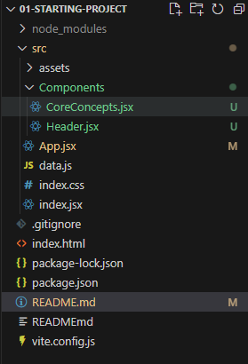

The component function can be a named export or a default 

**Importing and exporting components**
 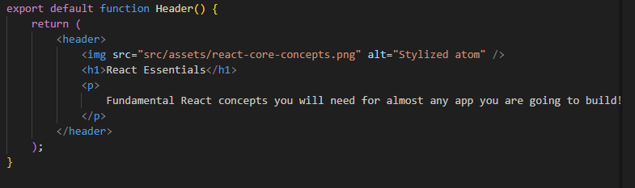


<h1>Storing Component Style Files Next To Components</h1>
creating a new file inside components Header.css and adding relevent css code inside it 

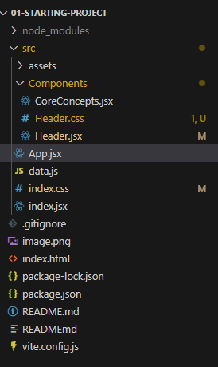

Then importing it into the relevent component 

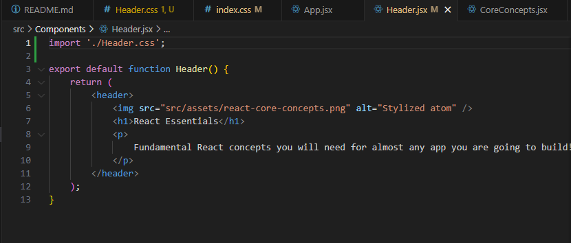

_Warning_ These styles are not automatically restricted to the corresponding component (later we will learn how it is done)

<h1> Component Composition: The special "children" Prop [Core Concept]</h1>

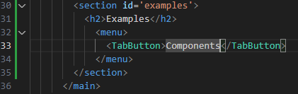

or 


The props.children property takes what ever there is between the TabButton element. In this case it is Components text

This approach of wrapping something in a component is called ***component composition***

<h1>Reacting to Events [Core Concept]</h1>

```jsx
export default function TabButton({children}){
    function handleClick(selectedButton){
        console.log("hello world");
    }

    return(
        <li><button onClick={handleClick}>{children}</button></li> // this is the correct way to do
        // <li><button onClick={handleClick()}>{children}</button></li> 
        // if we rigiht like this the fun will execute when the line gets executes and that we do not want
    );
}
```
<h1>Passing Functions as Values to Props</h1>

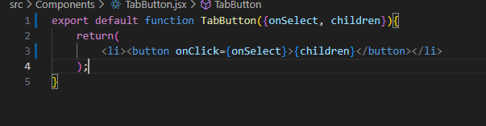

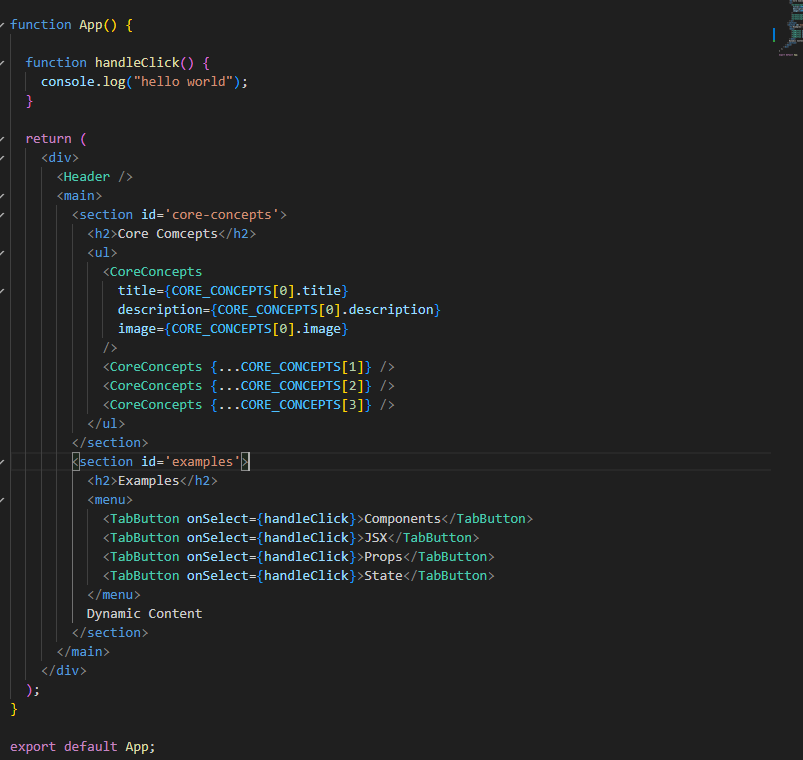

<h1>Passing Custom Arguments to Event Functions</h1>

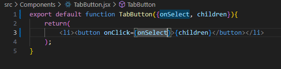

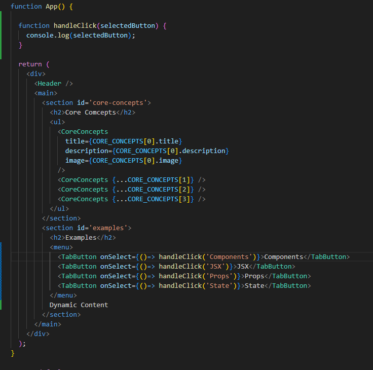

<h1>How NOT to Update the UI - A Look Behind The Scenes of React [Core Concept]</h1>

```jsx
function App() {
  let tabContent = "please click a button";

  function handleClick(selectedButton) {
    tabContent = selectedButton;
    console.log(tabContent);
  }

  return (
    <div>
      <Header />
      <main>
        <section id='core-concepts'>
          <h2>Core Comcepts</h2>
          <ul>
            <CoreConcepts
              title={CORE_CONCEPTS[0].title}
              description={CORE_CONCEPTS[0].description}
              image={CORE_CONCEPTS[0].image}
            />
            <CoreConcepts {...CORE_CONCEPTS[1]} />
            <CoreConcepts {...CORE_CONCEPTS[2]} />
            <CoreConcepts {...CORE_CONCEPTS[3]} />
          </ul>
        </section>
        <section id='examples'>
          <h2>Examples</h2>
          <menu>
            <TabButton onSelect={()=> handleClick('Components')}>Components</TabButton>
            <TabButton onSelect={()=> handleClick('JSX')}>JSX</TabButton>
            <TabButton onSelect={()=> handleClick('Props')}>Props</TabButton>
            <TabButton onSelect={()=> handleClick('State')}>State</TabButton>
          </menu>
          {tabContent}
        </section>
      </main>
    </div>
  );
}

export default App;
```
Here the tabcontent will not get updated visually thought it gets changed.
This issue is because the app content is not getting reevaluated. 
This is where <b style="background-color: red;">State</b> comes into play

```jsx
export default function TabButton({onSelect, children}){
    return(
        <li><button onClick={onSelect}>{children}</button></li>
    );
}
```
<h1>Managing State & Using Hooks [Core Concept]</h1>

To use state we have to import the *'useState()'* from 'react'. 
All the functions that starts from use are react hooks and they must be called inside react component function or other react hooks or custom react hooks(we will learn about them later in this course);

UseState must be called at the top level of the component function it should not be inside nested function or other statements. 

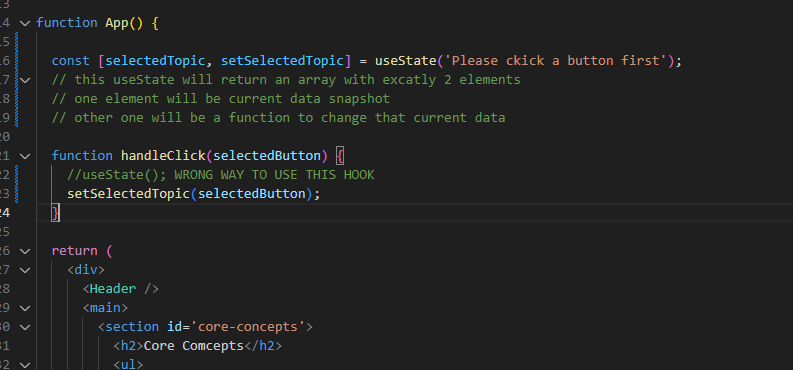

//***** The state value showing previous value is explained at 9:26 continue from there 

When we call the stateUpdating function react schedules this state updated and then reexecutes this component function. So the updated value will be visible after this component executed again. Only then the new value is availabe. 

<h1>Deriving & Outputting Data Based on State</h1>

This is how we can use state to output values 

```jsx
import { CORE_CONCEPTS } from './data';
import Header from './Components/Header.jsx';
import CoreConcepts from './Components/CoreConcepts.jsx';
const reactDescriptions = ['Fundamental', 'Crucial', 'Core'];
import TabButton from './Components/TabButton.jsx';
import { EXAMPLES } from './data';
import { useState } from 'react';

function genRandomInt(max) {
  return Math.floor(Math.random() * (max + 1));
}

function App() {

  const [selectedTopic, setSelectedTopic] = useState('components');
  // this useState will return an array with excatly 2 elements
  // one element will be current data snapshot
  // other one will be a function to change that current data  

  function handleClick(selectedButton) {
    //useState(); WRONG WAY TO USE THIS HOOK
    setSelectedTopic(selectedButton);
    console.log(selectedTopic);
    // this log will output previsos value this is because Lec 54 9:30
    // when we call the setSelectedTopic function 
  }

  return (
    <div>
      <Header />
      <main>
        <section id='core-concepts'>
          <h2>Core Comcepts</h2>
          <ul>
            <CoreConcepts
              title={CORE_CONCEPTS[0].title}
              description={CORE_CONCEPTS[0].description}
              image={CORE_CONCEPTS[0].image}
            />
            <CoreConcepts {...CORE_CONCEPTS[1]} />
            <CoreConcepts {...CORE_CONCEPTS[2]} />
            <CoreConcepts {...CORE_CONCEPTS[3]} />
          </ul>
        </section>
        <section id='examples'>
          <h2>Examples</h2>
          <menu>
            <TabButton onSelect={() => handleClick('components')}>Components</TabButton>
            <TabButton onSelect={() => handleClick('jsx')}>JSX</TabButton>
            <TabButton onSelect={() => handleClick('props')}>Props</TabButton>
            <TabButton onSelect={() => handleClick('state')}>State</TabButton>
          </menu>
          <div id='tab-content'>
            <h3>{EXAMPLES[selectedTopic].title}</h3>
            <p>{EXAMPLES[selectedTopic].description}</p>
            <pre>
              <code>
                {EXAMPLES[selectedTopic].code}
              </code>
            </pre>
          </div>
        </section>
      </main>
    </div>
  );
}

export default App; 
```
```js
export const EXAMPLES = {
  components: {
    title: 'Components',
    description:
      'Components are the building blocks of React applications. A component is a self-contained module (HTML + optional CSS + JS) that renders some output.',
    code: `
function Welcome() {
  return <h1>Hello, World!</h1>;
}`,
  },
  jsx: {
    title: 'JSX',
    description:
      'JSX is a syntax extension to JavaScript. It is similar to a template language, but it has full power of JavaScript (e.g., it may output dynamic content).',
    code: `
<div>
  <h1>Welcome {userName}</h1>
  <p>Time to learn React!</p>
</div>`,
  },
  props: {
    title: 'Props',
    description:
      'Components accept arbitrary inputs called props. They are like function arguments.',
    code: `
function Welcome(props) {
  return <h1>Hello, {props.name}</h1>;
}`,
  },
  state: {
    title: 'State',
    description:
      'State allows React components to change their output over time in response to user actions, network responses, and anything else.',
    code: `
function Counter() {
  const [isVisible, setIsVisible] = useState(false);

  function handleClick() {
    setIsVisible(true);
  }

  return (
    <div>
      <button onClick={handleClick}>Show Details</button>
      {isVisible && <p>Amazing details!</p>}
    </div>
  );
}`,
  },
};
```

<h1>Rendering Content Conditionally</h1>

***We can output null in jsx file it will lead to nothing***

This is how we can conditionally output the above code.
These are the changes made to the above code.

```jsx
 const [selectedTopic, setSelectedTopic] = useState('');

  <section id='examples'>
          <h2>Examples</h2>
          <menu>
            <TabButton onSelect={() => handleClick('components')}>Components</TabButton>
            <TabButton onSelect={() => handleClick('jsx')}>JSX</TabButton>
            <TabButton onSelect={() => handleClick('props')}>Props</TabButton>
            <TabButton onSelect={() => handleClick('state')}>State</TabButton>
          </menu>
          {!selectedTopic? <p>Please select a topic</p> : null}
          {selectedTopic ? (<div id='tab-content'>
            <h3>{EXAMPLES[selectedTopic].title}</h3>
            <p>{EXAMPLES[selectedTopic].description}</p>
            <pre>
              <code>
                {EXAMPLES[selectedTopic].code}
              </code>
            </pre>
          </div>): null}
        </section>
```
We can write this in more consise way like-

```jsx
 <section id='examples'>
          <h2>Examples</h2>
          <menu>
            <TabButton onSelect={() => handleClick('components')}>Components</TabButton>
            <TabButton onSelect={() => handleClick('jsx')}>JSX</TabButton>
            <TabButton onSelect={() => handleClick('props')}>Props</TabButton>
            <TabButton onSelect={() => handleClick('state')}>State</TabButton>
          </menu>
          {!selectedTopic && <p>Please select a topic</p>}  // here we hanve use && instead od ternary operator
          {selectedTopic && (<div id='tab-content'>
            <h3>{EXAMPLES[selectedTopic].title}</h3>
            <p>{EXAMPLES[selectedTopic].description}</p>
            <pre>
              <code>
                {EXAMPLES[selectedTopic].code}
              </code>
            </pre>
          </div>)}
        </section>
```

We can also use variable to conditionally output the above code like -

```jsx
function App() {

  const [selectedTopic, setSelectedTopic] = useState('');
  // this useState will return an array with excatly 2 elements
  // one element will be current data snapshot
  // other one will be a function to change that current data  

  function handleClick(selectedButton) {
    //useState(); WRONG WAY TO USE THIS HOOK
    setSelectedTopic(selectedButton);
    console.log(selectedTopic);
    // this log will output previsos value this is because Lec 54 9:30
    // when we call the setSelectedTopic function 
  }

  let tabContent = <p>Please select a topic</p>;

  if(selectedTopic){
    tabContent = <div id='tab-content'>
    <h3>{EXAMPLES[selectedTopic].title}</h3>
    <p>{EXAMPLES[selectedTopic].description}</p>
    <pre>
      <code>
        {EXAMPLES[selectedTopic].code}
      </code>
    </pre>
  </div>;
  }

  return (
    <div>
      <Header />
      <main>
        <section id='core-concepts'>
          <h2>Core Comcepts</h2>
          <ul>
            <CoreConcepts
              title={CORE_CONCEPTS[0].title}
              description={CORE_CONCEPTS[0].description}
              image={CORE_CONCEPTS[0].image}
            />
            <CoreConcepts {...CORE_CONCEPTS[1]} />
            <CoreConcepts {...CORE_CONCEPTS[2]} />
            <CoreConcepts {...CORE_CONCEPTS[3]} />
          </ul>
        </section>
        <section id='examples'>
          <h2>Examples</h2>
          <menu>
            <TabButton onSelect={() => handleClick('components')}>Components</TabButton>
            <TabButton onSelect={() => handleClick('jsx')}>JSX</TabButton>
            <TabButton onSelect={() => handleClick('props')}>Props</TabButton>
            <TabButton onSelect={() => handleClick('state')}>State</TabButton>
          </menu>
          {tabContent}
        </section>
      </main>
    </div>
  );
}

export default App;         
```

<h1>CSS Styling & Dynamic Styling</h1>

In regular html we use (class) for elements however in jsx we will use (className).

We can dynamically set the styling using this approach-

```jsx
 <section id='examples'>
          <h2>Examples</h2>
          <menu>
            <TabButton onSelect={() => handleClick('components')} isActive={selectedTopic==='components'}>Components</TabButton>
            <TabButton onSelect={() => handleClick('jsx')} isActive={selectedTopic==='jsx'}>JSX</TabButton>
            <TabButton onSelect={() => handleClick('props')} isActive={selectedTopic==='props'}>Props</TabButton>
            <TabButton onSelect={() => handleClick('state')} isActive={selectedTopic==='state'}>State</TabButton>
          </menu>
          {tabContent}
        </section>
```
```jsx
export default function TabButton({onSelect, children, isActive}){
    return(
        <li><button className={isActive? 'active': undefined} onClick={onSelect}>{children}</button></li>
    );
}
```

<h1>Outputting List Data Dynamically</h1>

Here we have hard coded the number os CoreConcepts components.

```jsx
<ul>
            <CoreConcepts
              title={CORE_CONCEPTS[0].title}
              description={CORE_CONCEPTS[0].description}
              image={CORE_CONCEPTS[0].image}
            />
            <CoreConcepts {...CORE_CONCEPTS[1]} />
            <CoreConcepts {...CORE_CONCEPTS[2]} />
            <CoreConcepts {...CORE_CONCEPTS[3]} />
          </ul>
```
Here the code will break if we tamper with the origin data. 
This is not a right approach insted we have to output this list dynamically

This is how it is done 

```jsx
<ul>
  {CORE_CONCEPTS.map((conceptItem)=> (
    <CoreConcepts key={conceptItem.title} {...conceptItem} />
  ))}
</ul>
```

Here it is required by react to have key for the each list ti unique identification


<h1><b>Section 4: React Essentials - Components, JSX, Props, State & more</b></h1>

<h2>You dont have to use JSX</h2>

```jsx
<div id="content">
  <p>Hello world!</p>
</div>
```
Instead we can use this alternative 
```js
React.createElement(
  'div',
  {id: 'content'},
  React.createElement(
    'p',
    null,
    'Hello world!'
  )
)
```

<h2>Working with Fragments</h2>

While returning jsx code we should binh the elements inside a parent component like-

```jsx
return (
    <div> // or we can use <></> instead of div 
      <Header />
      <main>
        <section id='core-concepts'>
          <h2>Core Comcepts</h2>
          <ul>
            {CORE_CONCEPTS.map((conceptItem)=> (
              <CoreConcepts key={conceptItem.title} {...conceptItem} />
            ))}
            
          </ul>
        </section>
        <section id='examples'>
          <h2>Examples</h2>
          <menu>
            <TabButton onSelect={() => handleClick('components')} isActive={selectedTopic==='components'}>Components</TabButton>
            <TabButton onSelect={() => handleClick('jsx')} isActive={selectedTopic==='jsx'}>JSX</TabButton>
            <TabButton onSelect={() => handleClick('props')} isActive={selectedTopic==='props'}>Props</TabButton>
            <TabButton onSelect={() => handleClick('state')} isActive={selectedTopic==='state'}>State</TabButton>
          </menu>
          {tabContent}
        </section>
      </main>
    </div>
  );
```

OR ELSE it will give raise to error like below
Here there there are multiple elements inside the return jsx code 
```jsx
return (
    
      <Header />
      <main>
        <section id='core-concepts'>
          <h2>Core Comcepts</h2>
          <ul>
            {CORE_CONCEPTS.map((conceptItem)=> (
              <CoreConcepts key={conceptItem.title} {...conceptItem} />
            ))}
            
          </ul>
        </section>
        <section id='examples'>
          <h2>Examples</h2>
          <menu>
            <TabButton onSelect={() => handleClick('components')} isActive={selectedTopic==='components'}>Components</TabButton>
            <TabButton onSelect={() => handleClick('jsx')} isActive={selectedTopic==='jsx'}>JSX</TabButton>
            <TabButton onSelect={() => handleClick('props')} isActive={selectedTopic==='props'}>Props</TabButton>
            <TabButton onSelect={() => handleClick('state')} isActive={selectedTopic==='state'}>State</TabButton>
          </menu>
          {tabContent}
        </section>
      </main>
    
  );
```
Having an extra div in our website is totally unnecessary that is why we can use (<Fragment></Fragment> (import this fragment from react) or simply using <></> without the need to import) this wraping element to reduce the div usage 


<h2>  When Should You Split Components?</h2>
Here if we click the Buttons under examples the dynamic numer produced in the header beside fundaments also changes 

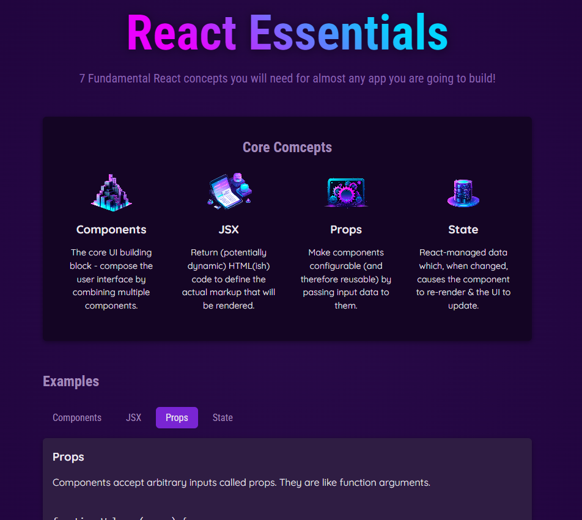
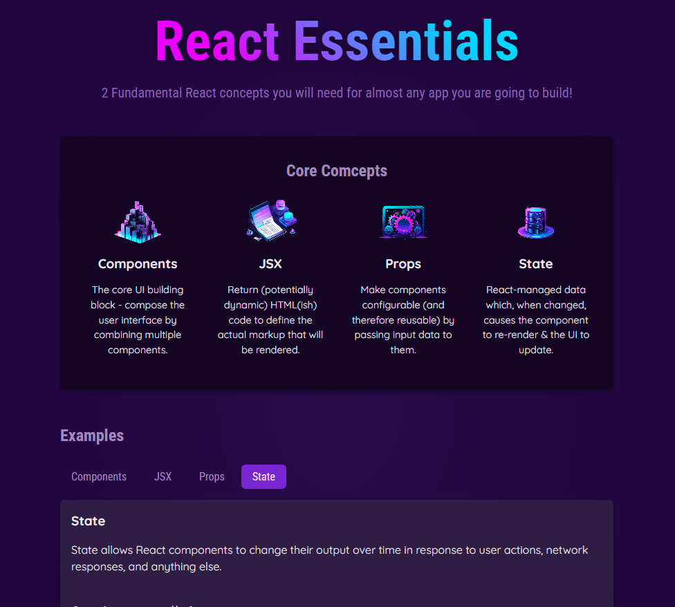

This should not happen. Only the intended compoent should get rerendered 
This is where splitting of components can help us 
<h2> Splitting Components By Feature & State </h2>

Spllitting the components this way will eliminate the full rendering as we saw above 

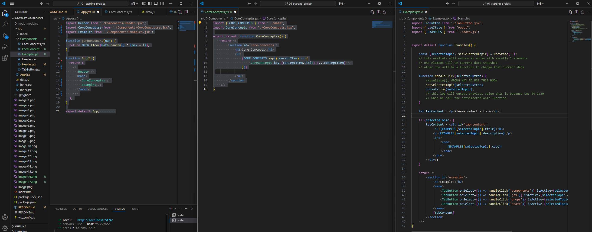

<h2>Problem: Props Are Not Forwarded To Inner Elements</h2>

Imagine a case where we are using this pattern repetidly 
```jsx
<section>
  <h2>title</h2>
  <ul>
     {children}
  </ul>
</section>
```
In such case we can create a new element Section.jsx

This element can be called and set props ann children this will further simplify the structure.

Section.jsx
```jsx
lec 65 not so important 
```
<h2>Working with multiple JSX Slots</h2>


App.js
```jsx
return <>
        <section id='examples'>
        <h2>Examples</h2>
            <Tabs
             buttons={<>
             <TabButton onSelect={() => handleClick('components')} isActive={selectedTopic === 'components'}>Components</TabButton>
                <TabButton onSelect={() => handleClick('jsx')} isActive={selectedTopic === 'jsx'}>JSX</TabButton>
                <TabButton onSelect={() => handleClick('props')} isActive={selectedTopic === 'props'}>Props</TabButton>
                <TabButton onSelect={() => handleClick('state')} isActive={selectedTopic === 'state'}>State</TabButton>
             </>}>
             {tabContent}
             </Tabs>
        </section>
    </>
```
Tabs.jsx
```jsx
export default function Tabs({buttons, children}){
    return <>
        <menu>
        {buttons} // slot 1
        </menu>
        {children} // slot 2
    </>
}
```
**This is how we can work with multiple JSX slots**

<h2>Settings Component Types Dynamically</h2>

Instead of above Tabs.jsx where we have used menu statically we can set it dynamically 

Using built in html element 
App.jsx
```jsx
return <>
        <section id='examples'>
        <h2>Examples</h2>
            <Tabs
            buttonsContainers="menu"
             buttons={<>
             <TabButton onSelect={() => handleClick('components')} isActive={selectedTopic === 'components'}>Components</TabButton>
                <TabButton onSelect={() => handleClick('jsx')} isActive={selectedTopic === 'jsx'}>JSX</TabButton>
                <TabButton onSelect={() => handleClick('props')} isActive={selectedTopic === 'props'}>Props</TabButton>
                <TabButton onSelect={() => handleClick('state')} isActive={selectedTopic === 'state'}>State</TabButton>
             </>}>
             {tabContent}
             </Tabs>
        </section>
    </>
```

Using custom element in above code 

App.jsx
```jsx
return <>
        <section id='examples'>
        <h2>Examples</h2>
            <Tabs
            buttonsContainers={CustomComponent}
             buttons={<>
             <TabButton onSelect={() => handleClick('components')} isActive={selectedTopic === 'components'}>Components</TabButton>
                <TabButton onSelect={() => handleClick('jsx')} isActive={selectedTopic === 'jsx'}>JSX</TabButton>
                <TabButton onSelect={() => handleClick('props')} isActive={selectedTopic === 'props'}>Props</TabButton>
                <TabButton onSelect={() => handleClick('state')} isActive={selectedTopic === 'state'}>State</TabButton>
             </>}>
             {tabContent}
             </Tabs>
        </section>
    </>
```

Tabs.jsx
```jsx
export default function Tabs({ buttons, children, buttonsContainers }) {
    const ButtonsContainers = buttonsContainers; // adding this line will store buttonsContainers in new variable that starts with uppercase charecter
    return <>
        <ButtonsContainers>
            {buttons} // slot 1
        </ButtonsContainers>
        {children} // slot 2
    </>
}
```

Instead this line "const ButtonsContainers = buttonsContainers; " we can simply add property with uppercase first charecter like-

```jsx 
export default function Tabs({ buttons, children, ButtonsContainers }) {
    return <>
        <ButtonsContainers>
            {buttons} // slot 1
        </ButtonsContainers>
        {children} // slot 2
    </>
}
```
<h2>Setting Default prop values</h2>

we can add a default value to the properties like below

Tabs.jsx
```jsx
export default function Tabs({ buttons, children, ButtonsContainers="menu" }) {
    return <>
        <ButtonsContainers>
            {buttons} // slot 1
        </ButtonsContainers>
        {children} // slot 2
    </>
}
```
// setting custom component as a defaut value 

Tabs.jsx
```jsx
import Section from './components/Section.jsx';

export default function Tabs({ buttons, children, ButtonsContainers=Section }) {
    return <>
        <ButtonsContainers>
            {buttons} // slot 1
        </ButtonsContainers>
        {children} // slot 2
    </>
}
```

and after this we do not have to set ButtonsContainers property while using the Tabs component when intending to use menu.


