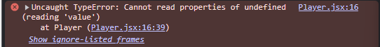
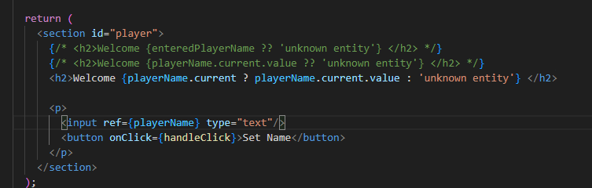

<h1>131. Repetition: Managing User Input with State (Two-Way-Binding)</h1>
Here we will know how we will change the some text in the ui based on State.</br>
But this way takes many State to handle the change just the text, as seen below...


Just to change this unkown title and set it to user input we have to write this lengthy code.. 

```jsx
import { useState } from "react";

export default function Player() {
  const [enteredPlayerName, setEnteredPlayerName] = useState('');
  const [submitted, setSubmitted] = useState(false);

  function handleClick(event){
    setSubmitted(false);
    setEnteredPlayerName(event.target.value);
  }

  function handleSubmit(){
    setSubmitted(true);
  }

  return (
    <section id="player">
      <h2>Welcome {submitted? enteredPlayerName : 'unknown entity'} </h2>
      <p>
        <input onChange={handleClick} type="text" value={enteredPlayerName}/>
        <button onClick={handleSubmit}>Set Name</button>
      </p>
    </section>
  );
}
```

<h1>133. Introducing Refs: Connecting & Accessing HTML Elements via Refs</h1>
As we saw above that way takes multiple states for the desired functionality. </br>
But Refs can help us do that in an optimal way. Let see how... 

We have to import useRef from react. </br>

```jsx
import { useState, useRef } from "react";

export default function Player() {
  const playerName = useRef();

  const [enteredPlayerName, setEnteredPlayerName] = useState(null);

  function handleClick(){
    setEnteredPlayerName(playerName.current.value);
  }

  return (
    <section id="player">
      <h2>Welcome {enteredPlayerName ?? 'unknown entity'} </h2>
      <p>
        <input ref={playerName} type="text"/>
        <button onClick={handleClick}>Set Name</button>
      </p>
    </section>
  );
}
```
We can use the useref hook and set it to a const than connect it to the input using the ref property. </br>
This way the input is binded with the playerName ref</br>
We can access all the properties associated with the input using this ref. </br>
We can get rid of the value and onchange properties of the input, we just have to use the reference for our use. </br>

For use cases like this where we wanna read a value from an input this approach will save lots of code and make our code leaner. </br>

<h1>134. Manipulating the DOM via Refs</h1>


What is we want to empty the input after submitting the button. 


```jsx
  function handleClick(){
    setEnteredPlayerName(playerName.current.value);
    playerName.current.value = '';
  }

```

We can simply do this when there are no states liked to the input. </br>
It would be not a great idea to manupulate everthing with the refs. 

<h1>135. Refs vs State values</h1>

```jsx
import { useState, useRef } from "react";

export default function Player() {
  const playerName = useRef();

  const [enteredPlayerName, setEnteredPlayerName] = useState(null);

  function handleClick(){
    setEnteredPlayerName(playerName.current.value);
    playerName.current.value = '';
  }

  return (
    <section id="player">
      {/* <h2>Welcome {enteredPlayerName ?? 'unknown entity'} </h2> */}
      <h2>Welcome {playerName.current.value ?? 'unknown entity'} </h2>
      <p>
        <input ref={playerName} type="text"/>
        <button onClick={handleClick}>Set Name</button>
      </p>
    </section>
  );
}
```

If i use the playerName.current.value instead of state and try to render this in browser we will face a error like..


This is because the playerName is not the connection with the ref prop wont be established for the first render cycle. So we get error... </br>

Instead if we write like this.. 

The error goes away. But the changes wont appear in the ui. 

Just the "unknown entity" goes away. </br>
This is because when ever a ref changes the component does not rerenders unlike the state. 

Whenever a ref changeses the component function do not rerenders. <br/>
<h2>State</h2>
>Causes component re-evaluation when changed. <br/>
> Should be used for values that are directly reflected in the UI. <br/>
>Should not be used for "behind the scenes" values that have no direct UI impact.

<h2>Refs</h2>
>Do not cause component re-evaluation when changed. <br/>
>Can be used to gain direct DOM element access (great for reading values or accessing certain browser APIs)
